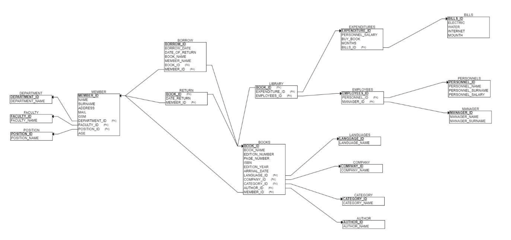
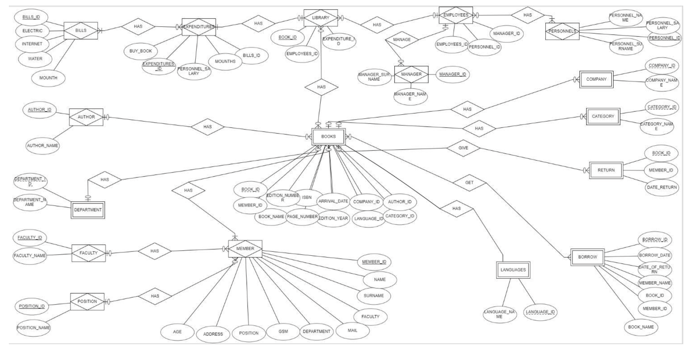
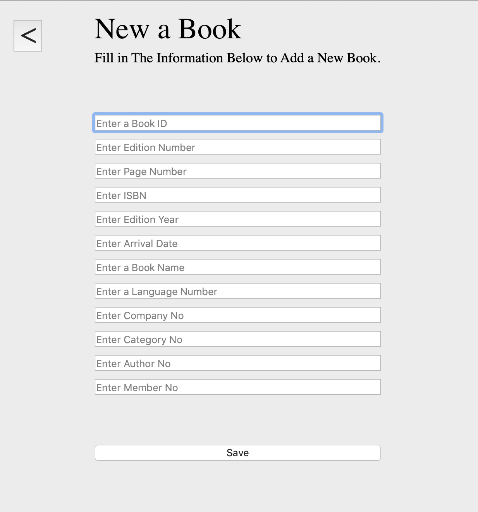

# Library Database System
This open source project includes the database system of a library and an interface written in Python.

INTRODUCTION

> It is desirable design a database for a library. The director and staff working in the library are responsible for the library. Each member individual information and book information is kept. The maneger makes the process of adding books, deleting books, updating in a personnel information, checking all personnel. The staff member can view the member information so they can access the member information. This database also contains polarity information , personnel data of members, books and outhor information received by the member.

WHO USES THIS DATABASE?

> Manager and personnels uses this database and so that he or she can observe everything about library. Employees can buy books and give a book to members.

LIBRARY BUSINESS RULES

1. The library is managed by the principal.
2. Personnel are supervised by the principal.
3. The library has different expenses.
4. These expenditures include personnel salary , bills and price of the book.
5. There are different books in the library.
6. Each book has its own ; book ID, book name ,edition number , page number , ISBN , edition year , arrival date , language ID , company ID , category ID , author ID and member ID.
7. The library has own subject title ; books , expenditures and employees.
8. The book ID section itself is divided into borrow and return.
9. The borrow section contains member ID , borrow date , return date and book ID .
10. Member information includes member ID , name , surname , address , mail , gsm , department ID, faculty ID , position ID.
11. There are books in different languages in the library.
12. A manager administer a library.
13. Each member can only receive more than on book.
14. A member who is punished in the library cannot get a book again.

ER-DIAGRAM

ENTITY AND RELATIONSHIPS SETS DIAGRAM

NORMALIZATION

• Normalization has two main objectives. To eliminate data repetitions in the database and to increase data consistency (accuracy).
• Normalization is the best solution to avoid data duplication and data inconsistency. In order to use our data more efficiently and comprehensively, we should design our databases with normalization forms.
• We checked all our tables according to normalization forms.

    <tr>
    <a href="https://allcontributors.org">
        
        
      
   
        </tr>

## LICENSE

[MIT](LICENSE)
