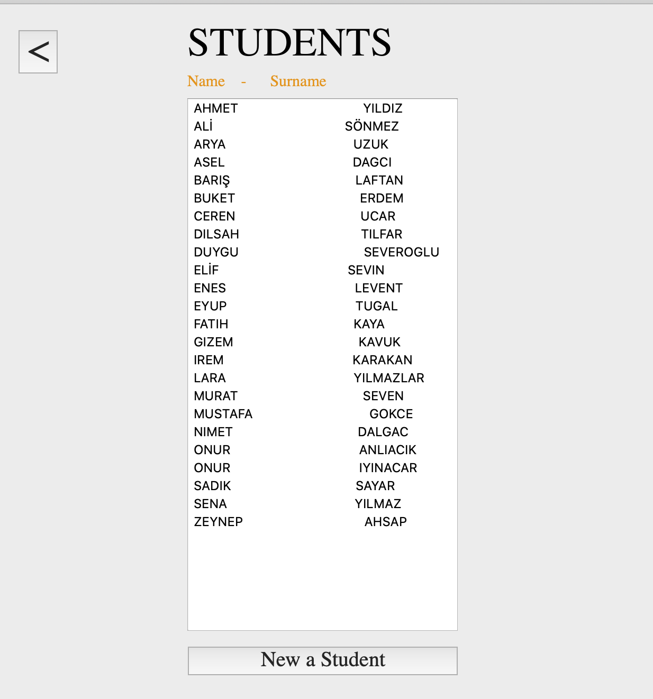

> Heyy! Gaziantep Üniversitesi Veritabanı dersi için takım arkadaşlarım ile geliştirdiğimiz kütüphane uygulamasını inceliyorsun!

    <tr>
    <a href="https://allcontributors.org">
        
        
      
   
        </tr>

Açık kaynak kodlu bu proje bir kütüphanenin veritabanı sistemini ve Python ile yazılmış bir arayüzünü içerir.

## LICENSE

[MIT](LICENSE)
